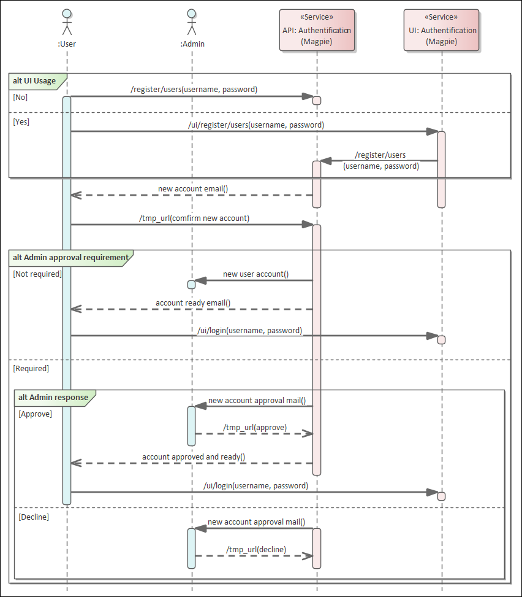

.. include:: references.rst

.. _auth_methods:

Authentication and Authorization
==========================================

In order to perform :term:`Authentication` in `Magpie`, multiple :term:`Provider` and methods are supported.
By default, the :term:`Internal Provider <Internal Providers>` named ``ziggurat`` is employed, which corresponds
to the package used internally to manage all `Magpie` elements.
Login procedure is covered in :ref:`Authentication Requests` section.

Supported :term:`External Providers` are presented in the table below in section :ref:`authn_providers`, although more
could be added later on.

.. warning::
    Terms :term:`Authentication` :term:`Provider`, :term:`External Providers` and :term:`External Providers` in this
    chapter must not be confused with ``providers`` employed in :ref:`config_providers`. In this chapter, providers
    refer to user-identity resolvers, in contrast to :term:`Service` definitions from the configuration files.

All :term:`Authentication` request can be accomplished in order to login using *existing* :term:`User` accounts.
To create new accounts, either another :term:`User` with :envvar:`MAGPIE_ANONYMOUS_GROUP` membership must create it,
or using the :ref:`user_registration` operation when enabled.

.. _authn_requests:

Authentication Requests
---------------------------

The most convenient way to sign-in with `Magpie` is to employ the user interface provided on path
``{MAGPIE_URL}/ui/login``. This page will present fields that allow both :term:`Internal Providers`
and :term:`External Providers` login methods.

Alternatively, API requests can be employed to define your own interface, or to obtain request tokens needed to
accomplish further requests interactions toward `Magpie` or obtain :term:`Authorization` from the :term:`Proxy` using
`Magpie` to enforce policies.

Following are the supported request formats.

.. _authn_req_method:

Request Method
~~~~~~~~~~~~~~~

Both ``GET`` and ``POST`` are supported. This is in order to allow resolution of credentials for some
applications that do not correctly handle or purposely prohibit use of ``POST`` method. Also, ``GET`` helps quickly
accomplishing a login from a web browser using the ``{MAGPIE_URL}/signin`` endpoint with query parameters
(see :ref:`authn_login_query`).

.. note::
    Whenever possible, prefer ``POST`` request with :ref:`authn_login_body` or the UI endpoint.
    See also warning in :ref:`authn_login_query` for details.

For each of the following request variants, the ``user_name`` field can refer to either the literal name representing
the :term:`User`, or its ``email`` employed during registration. The submitted value will be tested against both to
retrieve a potential matches to accomplish :term:`Authentication`.

.. _authn_login_query:

Query Parameters
~~~~~~~~~~~~~~~~~~~~

This method employs the query string parameters in the URL to provide the credentials. The format is as follows.

.. code-block:: http

    GET /signin?user_name=<usr>&password=<pwd> HTTP/1.1
    Host: {MAGPIE_URL}

The response will contain :ref:`Authentication Headers` detail needed for user identification.

.. warning::
    Whenever possible, it is **strongly** recommended to instead use another one of the methods which offers
    better support for different ``Content-Type`` responses to interact with `Magpie` as an API.

    Furthermore, using the ``POST`` method with content body and/or headers reduces risks of credential leaks that
    would be visible in plain text via query parameters using ``GET`` request. Most servers and applications log path
    and query parameters profusely, or even caches them, which can lead to easier identity theft or hacking of servers.
    The ``GET`` method remains available for backward compatibility and quick testing purposes only.

.. _authn_login_body:

Body Content
~~~~~~~~~~~~~~~~~~~

Body content requests allow multiple variants, based on the specified ``Content-Type`` header.
All variants employ a similar structure, but indicate the format of the body to be parsed.
By default, ``application/json`` is employed if none was specified.

.. code-block:: http

    POST /signin HTTP/1.1
    Host: {MAGPIE_URL}
    Content-Type: multipart/form-data; boundary=<boundary-string>

    --<boundary-string>
    user_name: "<usr>"
    password: "<pwd>"
    provider_name: "<provider>"     # optional
    --<boundary-string>--

.. code-block:: http

    POST /signin HTTP/1.1
    Host: {MAGPIE_URL}
    Content-Type: application/x-www-form-urlencoded

    user_name=<usr>&password=<pwd>&provider_name=<provider>

.. code-block::  http

    POST /signin HTTP/1.1
    Host: {MAGPIE_URL}
    Content-Type: application/json

    {
        "user_name": "<usr>",
        "password": "<pwd>",
        "provider_name": "<provider>"
    }

The response will contain :ref:`Authentication Headers` detail needed for user identification.

.. _authn_providers:

Authentication Providers
---------------------------

For any of the :term:`Authentication` requests, omitting the ``provider_name`` identifier
(or explicitly using value of :envvar:`MAGPIE_DEFAULT_PROVIDER`) will default to employ the :term:`Internal Providers`
method. This means that :term:`User` identity resolution will be attempted against locally registered users in `Magpie`
database.

To instead use one of the :term:`External Providers`, the corresponding provider identifier must be provided within
the sign-in request contents with ``provider_name``. The value of that field must be one of the available provider in
the below table.

Each provider has different configuration parameters as defined in `Magpie Security`_ module and use various protocols
amongst ``OpenID``, ``ESGF``-flavored ``OpenID`` and ``OAuth2``. Further :term:`External Providers` can be defined
using this module's dictionary configuration style following parameter specification of `Authomatic`_ package used for
managing this :term:`Authentication` procedure.

+--------------------------------+-----------------------------------------------------------------------+
| Category                       | Provider                                                              |
+================================+=======================================================================+
| Open Identity (``OpenID``)     | `OpenID`_                                                             |
+--------------------------------+-----------------------------------------------------------------------+
| *Earth System Grid Federation* | *German Climate Computing Centre* (`DKRZ`_)                           |
| (`ESGF`_) :sup:`(1)`           |                                                                       |
|                                +-----------------------------------------------------------------------+
|                                | *French Research Institute for Environment Science* (`IPSL`_)         |
|                                +-----------------------------------------------------------------------+
|                                | *British Centre for Environmental Data Analysis* (`CEDA`_) :sup:`(2)` |
|                                +-----------------------------------------------------------------------+
|                                | *US Lawrence Livermore National Laboratory* (`LLNL`_) :sup:`(3)`      |
|                                +-----------------------------------------------------------------------+
|                                | *Swedish Meteorological and Hydrological Institute* (`SMHI`_)         |
+--------------------------------+-----------------------------------------------------------------------+
| ``OAuth2``                     | `GitHub`_ Authentication (see :ref:`config_auth_github`)              |
|                                +-----------------------------------------------------------------------+
|                                | `WSO2`_ Open Source Identity Server (see :ref:`config_auth_wso2`)     |
+--------------------------------+-----------------------------------------------------------------------+

| :sup:`(1)` extended variant of ``OpenID``
| :sup:`(2)` formerly identified as *British Atmospheric Data Centre* (`BADC`_)
| :sup:`(3)` formerly identified as *Program for Climate Model Diagnosis & Intercomparison* (`PCMDI`_)

.. note::
    Please note that due to the constantly changing nature of multiple of these external providers (APIs and moved
    Websites), rarely used authentication bridges by the developers could break without prior notice. If this is the
    case and you use one of the broken connectors, summit a new `issue`_.

Using any of the :term:`External Providers` will tell `Magpie` to interrogate the configured identity URL of that
provider and use the credentials to attempt :term:`Authentication`. If successful, the response returned by that
:term:`Provider` should be parsed by `Magpie` in order to determine which corresponding local :term:`User` profile
it refers to. After validation, the :term:`Logged User` will be authenticated and following requests will be
applicable using the same ``Cookie`` methodology as when using normal local provider procedure.
See :ref:`Authentication Headers` for more details on that matter.

.. _authn_headers:

Authentication Headers
---------------------------

.. versionadded:: 3.9
    The ``WWW-Authentication`` and ``Location-When-Unauthenticated`` headers are returned whenever the
    HTTP ``Unauthorized [401]`` response is the result of a request. This is done in order to help requesting
    users or applications identify the endpoint where it can attempt :term:`Authentication` with credentials.

After execution of an :term:`Authentication` request, a ``Set-Cookie`` header with `Magpie` user identification token
named according to :ref:`config_security` should be set in the response as follows.

.. code-block:: http

    Set-Cookie: {MAGPIE_COOKIE_NAME}=<auth-token>!userid_type:int;
                [Domain=<domain>; Path=<path>; HttpOnly; SameSite=Lax; Max-Age=<seconds>; expires=<datetime>]

Web browsers and libraries for HTTP requests handling should automatically detect that header and register the defined
``Cookie`` for subsequent requests. Alternatively, that ``Cookie`` can be provided directly in the request using the
same format.

All additional parameters (in brackets above) are optional and can be provided to explain how control of the scope the
`Magpie` cookie applies to, notably to avoid conflicts with other potential cookies employed by the request. The only
mandatory parts are the :envvar:`MAGPIE_COOKIE_NAME` value, the actual token value, and the indication of represented
content with ``!userid_type:int`` to let `Magpie` known the provided token information is employed to resolve the
:term:`Logged User` by ID.

Note that any ``Cookie`` generated by `Magpie` can have a maximum valid duration, identified by the both the returned
``Max-Age`` in seconds and the ``expires`` value as explicit date and time. Generated cookies are defined in such a way
that they will automatically emit a new ``Cookie`` based on reissue time after 1/10th of the ``Max-Age`` to update the
``Cookie`` over continuous sessions. Any :term:`Logged User` will therefore remain logged in if further requests are
accomplished using the same ``Cookie`` within the lifetime duration of the original login, unless explicitly logged out.
Modifications of the duration is accomplished using configuration detailed in :ref:`config_security`.

.. versionchanged:: 3.9
    Although maximum duration could be defined in settings, prior versions did not explicitly indicate them in the
    generated ``Cookie``. Following versions without these values will effectively mean the ``Cookie`` has unlimited
    lifetime.

As for most of the other API request endpoints offered by `Magpie`, the ``Accept`` header can be provided to select the
format of the desired returned content. Following valid :term:`Authentication`, the body should contain a basic message
indicating as such, and returning ``OK [200]`` status. Otherwise, the appropriate HTTP error code will be returned with
a description message of the error cause. By default, header definition ``Accept: */*`` or completely omitted value for
``Accept`` will employ ``application/json`` for the returned ``Content-Type``.

.. _authz_headers:

Authorization Headers
---------------------------

Following any successful :term:`Authentication` request as presented in the previous section, the obtained ``Cookie``
defines which :term:`Logged User` attempts to accomplish an operation against a given protected URI. `Magpie` employs
the same ``Cookie`` both for operations provided by its API and for accessing the real :term:`Resource` protected
behind the :term:`Proxy` according to resolution of :term:`Effective Permissions <Effective Permission>` based on
:term:`Applied Permission` definitions.

Access to Magpie Operations
~~~~~~~~~~~~~~~~~~~~~~~~~~~~~~~

When a :term:`Logged User` has sufficient :term:`Permission`, it will be allowed different levels of access to
operate onto `Magpie` API paths. The specific requirements for each case are extensively presented in section
:ref:`perm_route_access`.

.. _authz_protected_resources:

Access to Protected Resources
~~~~~~~~~~~~~~~~~~~~~~~~~~~~~~~

When sending requests to the :term:`Policy Enforcement Point` (PEP) (e.g.: `Twitcher`_ :term:`Proxy`),
appropriate ``Cookie`` headers must be defined for it to identify the :term:`Logged User` and resolve its
:term:`Effective Permissions <Effective Permission>` accordingly. Not providing those tokens will default to using
:envvar:`MAGPIE_ANONYMOUS_USER`, which will result into either one of HTTP ``Unauthorized [401]`` or
``Forbidden [403]``, depending on how the PEP interprets and returns the response indicated by `Magpie`, unless the
corresponding :term:`Resource` was allowed for :ref:`perm_public_access`.

When appropriately authenticated, access to the targeted :term:`Resource` will be granted or denied depending on the
:term:`Effective Permissions <Effective Permission>` that :term:`Logged User` has for it. This decision is extensively
explained in section :ref:`perm_resolution`.

Another alternative to obtain :term:`Authorization` (only when using the :ref:`Magpie Adapter <utilities_adapter>`) is
by providing the ``Authorization`` header in the request with appropriate credentials. In this situation, the adapter
will attempt a login operation inline to that original request, and if successful, will update the ``Cookie`` headers
accordingly. Although this method saves the need for the client to explicitly do an initial :term:`Authentication`
request toward `Magpie`'s signin path prior to :term:`Resource` access attempt, failing to update the following any
following requests with the ``Cookie`` will repeat the procedure on each call, which will slow down response time. If
multiple requests are executed, especially for accessing different protected resources, :ref:`authn_requests` should be
employed instead to process :term:`Authentication` only once.

The format of the ``Authorization`` header is has follows.

.. code-block:: http

    Authorization: Bearer <access_token>

Where the ``access_token`` must correspond with the applicable ``provider_name`` specified by query parameter in order
to orchestrate the :term:`Authentication` operation accordingly. Once again, omitting the ``provider_name`` will default
to :term:`User` identification against local accounts in `Magpie` using :envvar:`MAGPIE_DEFAULT_PROVIDER`.

.. fixme: https://github.com/Ouranosinc/Magpie/issues/255
.. todo::

    Support ``Authorization: Basic <base64-user-pass>`` (see `#255 <https://github.com/Ouranosinc/Magpie/issues/255>`_)

.. _user_registration:

User Registration
------------------------

.. versionadded:: 3.13

.. warning::
    Please refer to the **Security Notice** under :envvar:`MAGPIE_USER_REGISTRATION_ENABLED` regarding the impact
    of this change.

Using this feature, new :term:`User` accounts can be created by anyone (self-registration) instead of previously needed
administrative access to create them. The new accounts will require an unique ``user_name`` and valid ``email`` in order
to confirm and complete registration. The provided ``email`` is employed to send a notification and validation endpoint
of the specified registration information.

This operation must be enabled in the corresponding `Magpie` instance using :envvar:`MAGPIE_USER_REGISTRATION_ENABLED`
definition in :ref:`config_user_register_approval` settings for this feature to be available. Otherwise, the only
method to create new :term:`User` entries will remain through membership to :envvar:`MAGPIE_ADMIN_GROUP`
(see also :ref:`perm_route_access`). Administrators can always employ this direct :term:`User` creation mean regardless
of the enabled state of this feature.

Procedure
~~~~~~~~~~

Following is the summarized notification workflow to complete registration.

.. cannot use the 'term' in replace, or it breaks the reference link creation
.. _proc_user_registration:
.. |proc_user_registration| replace:: User Registration Procedure

.. container:: bordered-caption

    |proc_user_registration|

.. container:: bordered-content
    :name: proc_user_registration_block

    1. The procedure always start at reception of a new user account as requested from the `Magpie` UI frontpage
       (see the ``Register`` button to retrieve the submission form), or through the corresponding API request.
       Minimal validations of submitted fields and to avoid conflicts with existing :term:`User` is accomplished
       before moving on to the next step.

    2. Upon reception of a valid new registration, an email will be sent to the submitted email such that the
       :term:`Pending User` can validate its address with the provided confirmation link. This step is
       always required.

    3. Once the validation is received, there are two possible outcomes according to configured value of
       :envvar:`MAGPIE_USER_REGISTRATION_APPROVAL_ENABLED`.

        A) When :envvar:`MAGPIE_USER_REGISTRATION_APPROVAL_ENABLED` is **NOT** activated, only email validation is
           required from the confirmation email. When visiting the confirmation link inside the sent email, the
           emitted request received by `Magpie` will in that case immediately complete that :term:`User` registration
           process. The procedure moves directly to step (5) skipping (4).

        B) If :envvar:`MAGPIE_USER_REGISTRATION_APPROVAL_ENABLED` was instead activated, approval must first occur.
           This will be possible as reception of the validated email from the :term:`Pending User` will trigger
           another notification email toward :envvar:`MAGPIE_USER_REGISTRATION_APPROVAL_EMAIL_RECIPIENT`.
           That email should then be employed to *approve* or *decline* the subscription request with corresponding
           temporary token links.

    4. (Only if 3B) This step is the administrator review of the :term:`Pending User` registration request.
       When an administrator *approves* the :term:`Pending User` account, the procedure resumes normally with step (5).
       Otherwise, the account remains in pending state until invalidated. Invalidation occurs if the administrator
       *declines* the request or explicitly deletes the :term:`Pending User` using the corresponding API or UI methods.

    5. An email is sent back to the original submitter to notify them that their account is validated and ready to be
       employed. The now created :term:`User` will be able to login using the available :ref:`authn_requests` methods.

    6. (Optional) When :envvar:`MAGPIE_USER_REGISTRATION_NOTIFY_ENABLED` was activated, an additional notification
       email is sent to :envvar:`MAGPIE_USER_REGISTRATION_NOTIFY_EMAIL_RECIPIENT` to inform of the account that was
       validated and the generated :term:`User` from completed registration.
       This email can be the same as the approving administrator email, or a completely different
       authority, whichever is desired to be notified of completed new :term:`User` accounts.

.. note::
    Once a :term:`Pending User` is validated with the above procedure, the completed :term:`User` account will trigger
    any registered :term:`Webhook` in the same manner as if the :term:`User` was directly created by the administrator.

Following figure represents the described above behaviour of the registration steps according to enabled alternatives.

    User Registration Procedure demonstrating communication steps for each operation and alternatives.
    (Version 2.0, updated 2021-06-02)

Management
~~~~~~~~~~

All :term:`Pending User` details can be queried and managed only by administrator-level :term:`User`, using the
relevant API ``/register/users`` endpoint, or the query string ``status`` on normal API ``/users`` endpoint. Note that
user registration endpoints will return an ``HTTP Not Found [404]`` error if :envvar:`MAGPIE_USER_REGISTRATION_ENABLED`
was not set accordingly, which will disable the complete self-registration `procedure`_.

The :term:`Pending User` is a special kind of *user* that is treated differently than typical :term:`User` since their
account validation is incomplete, and will therefore not be returned by normal API and UI endpoints. Only explicit
queries (e.g.: ``status=pending``) or specialized requests endpoints will return those entries.

Regarding relationships with other `Magpie` concepts, such as :term:`Service`, :term:`Resource`, :term:`Group` or
:term:`Permission` definitions, those :term:`Pending User` will not be available and cannot be associated until
registration was processed completely. When account validation and approval is completed, the :term:`Pending User` is
upgraded to a full fledged :term:`User`, with all applicable operations on it. The :term:`User` account will then
operate normally as any other existing ones. That :term:`User` will also be able to proceed with
typical :ref:`authn_requests` procedures to login with `Magpie`.

Any :term:`Pending User` registration will be listed and accessible from the `Magpie` UI administration management area.
Therefore, if a validation email gets lost or is not processed by the relevant administrators, pending registrations can
still be obtained and processed by visiting the :term:`User` list page.

Customization
~~~~~~~~~~~~~

All notification emails sent by `Magpie` can be customized to match your specific requirements or format using
`Mako Template`_ files. Custom email contents should contain all relevant details defined in their corresponding default
templates to ensure that basic functionalities of the user registration and administrator approval `procedure`_ can be
accomplished as intended. The logic of the message content is left at the discretion of the developer if customized.

Furthermore, as described in the `procedure`_, :envvar:`MAGPIE_USER_REGISTRATION_APPROVAL_ENABLED` can be used to
specify whether administrator approval is required or not. This additional step is purely up to the developers and
server managers that use `Magpie` to decide if they desire more control over which individuals can join and access
their services.

.. _Network Mode:

Network Mode
------------

If the :envvar:`MAGPIE_NETWORK_ENABLED` is enabled, an additional external authentication provider is added to `Magpie`
which allows networked instances of `Magpie` to authenticate users for each other.

Users can then log in to any `Magpie` instance where they have an account and request a personal network token in the
form of a `JSON Web Token <https://datatracker.ietf.org/doc/html/rfc7519>`_ which can be used to authenticate this user
on any `Magpie` instance in the network.

Managing the Network
~~~~~~~~~~~~~~~~~~~~

In order for `Magpie` instances to authenticate each other's users, each instance must be made aware of the existence of
the others so that it knows where to send authentication verification requests.

In order to register another `Magpie` instance as part of the same network, an admin user can create a
:term:`Network Node` with a request to ``POST /network-nodes``. The parameters given to that request include a ``name``
and a ``url``. The ``name`` is a the name of that other `Magpie` instance in the network and should correspond to the
same value as the :envvar:`MAGPIE_NETWORK_INSTANCE_NAME` value set by the other `Magpie` instance. The ``url`` is a the root URL
of the other `Magpie` instance.

Once a :term:`Network Node` is registered, `Magpie` can use that other instance to authenticate users as long as the
other instance also has :envvar:`MAGPIE_NETWORK_ENABLED` enabled.

Managing Personal JWTs
~~~~~~~~~~~~~~~~~~~~~~

A :term:`User` can request a new network token with a request to the ``PATCH /token`` route.

Every time a :term:`User` makes a request to the ``PATCH /token`` route a new token is generated for them. This
effectively cancels all previously created tokens for that user.

Authentication
~~~~~~~~~~~~~~

Once a :term:`User` gets a personal network token, they can use that token to authenticate with any `Magpie` instance in
the same network. When a user makes a request, they should set the ``provider_name`` parameter to the value of
:envvar:`MAGPIE_NETWORK_PROVIDER` and provide the network token in the Authorization header in the following format:

.. code-block:: http

    Authorization: Bearer <network_token>

When using the :ref:`Magpie Adapter <utilities_adapter>`, the token can also be passed as a parameter to the request,
where the parameter name set by :envvar:`MAGPIE_NETWORK_TOKEN_NAME` and the value is the personal network token.

Authorization
~~~~~~~~~~~~~

Managing authorization for :term:`Users` who authenticate using personal network tokens is complicated by the fact that
a :term:`User` is not required to have a full account on both `Magpie` instances in order to using this authentication
mechanism. This means that a :term:`User` may be logged in as a node-specific "anonymous" user.

When another `Magpie` instance is registered as a :term:`Network Node`, a few additional entities are created:

#. a group used to manage the permissions of all users who authenticate using the new :term:`Network Node`.
   * this group's name will be the :envvar:`MAGPIE_NETWORK_NAME_PREFIX` followed by the :term:`Network Node` name
#. a group used to manage the permissions of all users who authenticate using *any* other instance in the network
   * this group's name will be the :envvar:`MAGPIE_NETWORK_GROUP_NAME`
   * this group will only be created once, when the first :term:`Network Node` is registered
#. an anonymous user that belongs to the two groups that were just created.
   * this user name will be the :envvar:`MAGPIE_NETWORK_NAME_PREFIX` followed by the :term:`Network Node` name

Here is an example to illustrate this point:

* There are 3 `Magpie` instances in the network named A, B, and C
* There is a :term:`User` named ``"toto"`` registered on instance A
* There is no :term:`User` named ``"toto"`` who belongs to the ``"anonymous_network_A"`` group registered on instance B
* There is a :term:`User` named ``"toto"`` who belongs to the ``"anonymous_network_A"`` group registered on instance C
* Instance A is registered as a :term:`Network Node` on instances B and C
* when ``"toto"`` gets a personal network token from instance A and uses it to log in on instance B they log in as the
  the temporary ``"anonymous_network_A"`` user.
* when ``"toto"`` gets a personal network token from instance A and uses it to log in on instance C they log in as the
  ``"toto"`` user on instance C.
